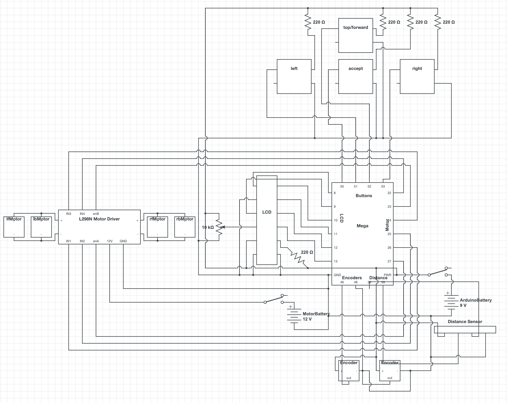

# Programmable, Autonomous Car
## Zale Diawara and Graden Gentry
## 5/6/23


 ## Design Summary

We have made a robotic car that will allow a user to set direction and distance instructions for the robot to follow. For instance, the user will start the car and the LCD display will ask for a direction which will be input using one of the three buttons ( black, white, blue). It will then put the current selection on the LCD display. If the user is satisfied with their selection, they will tap the red button to accept the response and it will move on to selecting a distance. A base distance will be already selected and the user will use the white and blue buttons to change the distance. It will only allow the user to select 0 cm if the user has previously selected a direction of right or left. If the user selects forward, the minimum distance is 20 cm and the maximum is 90 cm. Once the user is again satisfied with the selection they will tap the red button again and it will save the selection. At this point in the program, it will allow the user to do the process again, or run the robot by pressing the red button again. Once running, the car will make sure it doesn’t crash by using a distance sensor to stop it an average of 6 cm away from an object.


## System Details

The robot is using some basic parts like Arduino motors and more complex parts like the Arduino Mega Elegoo. The first element of the robot where everything starts is the Arduino Elegoo because that is where the code is stored and also it is the part that sends those codes to the motors, the buttons and the LCD screen. The Arduino Elegoo Mega is the communicator between the buttons and the motors to transmit the instructions from the buttons to the motors, between the buttons and the LCD screen to display the instructions given from the buttons and finally between the motors (especially the encoders) and the ultrasonic sensor to tell the motors to stop when the robot is too close to hit something (around 6 cm). 
All these parts need power to run. At the beginning we used a battery pack with eight rechargeable small batteries with 1.2V and 2000mAh each to power both the Arduino and motors but we found that it wasn’t enough to power both. Because of this we use eight rechargeable batteries to power the motors, and a 9V battery to power the Arduino  (Figure 3). 
The robot also needs a lot of code in order to run correctly and efficiently. We use two true and false encoders to determine position and are able to count encoder ticks. After the robot is started, the user will allow the robot to calibrate, and manual calibrate if needed, and then will push the red button to start the program. Then they will start creating instructions for the robot by selecting a direction and distance for each step as seen in Figure 2. Our wiring is fairly simple. We have a breadboard in the middle for power and ground that most things are plugged into. Through this, we are able to get many more slots for power and ground and it is easier to distribute power. Most of our wires are organized through zip ties and cable holders. You can see the wiring diagram in Figure 1. There are a lot of wires that we have to manage and contain. We are using a lot of the pins on our Arduino Mega, which was the entire point of getting it. We have put hot glue on most of the connections to the Arduino to make sure they stay connected.
The code is based on functions and is all linear. There is no code in the loop() section that Arduino gives you because this would result in a repetition of the code we want to run only once. To start, it runs the selection code, found in Code Block 1, and then will break out of that once it is told to run. This will repeatedly ask the user for two inputs, a direction and distance until the user decides to run the program. Then, it will run the code to make the motors run until the encoders count to a certain number based on the instructions the user has given. This code is found in Code Block 3. We have also created functions to run the LCD. These are able to cut the message that the LCD will use because the LCD is only 16 characters long. The print function, found in Code Block 2, checks that the message variable is less than the 16 character limit, but if it is more than 16 characters it will cut the message down and make a second message for the second line. We also ran into a problem with the true and false encoders, if one is true and the other is false, the one that is false will go farther than the one that is true. To solve this problem, we calibrate the encoders and motors through the functions in Code Block 4, which contains both automatic and manual calibration options. The automatic function works by making the motors stop when both encoders are false. The manual function will tell the user the current encoder values and finish once both are at the correct position.
We 3D printed two parts, the top of the robot and the 9V battery holder found in Figure 4 and 5 in the appendix. 3D printing was very useful because it allowed us to accurately manufacture parts that we needed. We used the top of the robot print to mount the LCD, buttons, switches, and batteries. We printed the 9V battery holder and attached it to the top of robot part.
There are not many mechanical aspects to this project but we have used the Spartan kit as a base. Our current drivetrain has four Arduino motors mounted to a metal frame from the Spartan kit. Two of these motors have encoder mounts built in. Mostly because it already had everything we needed so we could start testing immediately. There are special mounts for the encoders on the motors, and convenient spots to mount the motors. There are four beams that go straight up to attach the top of the robot to the bottom frame. Inside the frame, there is enough space for the Arduino, motor controller, and motors inside the robot.

## Design Evaluation

While building this robot, we have incorporated a LCD screen as an output display, four buttons for user input, a distance sensor and encoders for autonomous input, four reversible DC motors using a L289N motor driver, and a lot of programmed logic in the software. The programmed logic includes our algorithm that indexes through the variable called actions and tells the robot what to do, found in Code Block 5, and our logic that instructs the robot to run the LCD screen. Refer to Code Block 2 for more details on running the LCD screen. We have made every effort to make sure every connection is solid by hot gluing and soldering the wires and that there are no exposed wires that could cause harm. We have two switches that control power to the motors and the Arduino. If either switch is flipped off while the robot is driving, it will stop. Our cost was around $70, mostly used by the Arduino Spartan kit we used as our base. We chose this because it has pre-made slots for encoders and was extremely convenient to use. In addition, $20 was used on the Elegoo Arduino Mega, which has more digital pins than the regular Arduino Uno. We have used around 110 grams of filament. We have 3D printed a top to the robot and a 9V battery holder. This was very useful because it provides slots for the LCD, buttons, and batteries that can be accessed from the top of the robot. All components in our robot serve a defined purpose that is vital to the robot running correctly and accurately. We use one Elegoo Arduino Mega as our controller for this project, powered directly by a 9V battery. We also use a L298N motor controller powered by a 12V battery pack. In the beginning of this project, we knew hitting the early bird deadline was a must so we made it a priority to get most, if not all of the robot done by that date. We think the effort level for this project is actually fairly high as we used true and false encoders to count ticks, as well as a lot of trouble with making sure the lists are created and indexed correctly. 

## Complete Parts List

[Elegoo Arduino Mega][mega]
Part Num: LYSB01H4ZDYCE-ELECTRNCS - Arduino microcontroller - $20

[L298N Motor Controller][mcontroller]
Part Num: CECOMINOD012186m - Used to control all the motors and direction - $2

Arduino Spartan Kit  - Contains a base, four motors, two encoders - $50

[Ultrasonic Distance Sensor HC-SR04][dist]
Part Num: Dana-YJ171306 - $2

[4x Micro Switch Push Button][button]
Part Num: CYT1009 - $4

[AdaFruit Tiny Breadboard][bread]
Part Num: B071KCZZ4K - $4

[LCD Screen][lcd]
Part Num: HD44780 - $4

[4x 220 ohm resistor][resist]
Part Num: EFR-W0D50-A:MF - $0.06

[10k ohm potentiometer][potent]
Part Num: Breadboard trim kit - $4

[8 AA Battery Holder][connector]
Part Num: B07WP1CYYW - $4

[8x AA Battery][aaBat]
Part Num: DURACELL - 04343 - 12/PACK - $16

[9V Battery][batLink]
Part Num: MN1604B1Z - $7

## Lessons Learned

Some of the main issues we faced were in the wiring, the programming of the robot, and the true and false encoders. The robot is very compact and tight, which made it a challenge to organize and plug in wires, especially the buttons as they all had to go in at the same time. Although we got off to a quick start with the programming, it was a challenge to learn more about how Arduino char type variables work and how to take a specific value out of that correctly. We fixed this by taking the original value and subtracting the ASCII value of 0, our starting number. We also learned more about how adding characters to the end of a string works. This was a little bit of a challenge because we weren’t able to just add the character to the end of the string and we ended up having to replace the very end character in order to make it work better. You can see this in Code Block 1 in the appendix, where we take the message’s length, and then replace the end character ( a space ), with the selected character. We would recommend that other students try to keep all variables in the same format so you don't run into any errors trying to convert between types, specifically ASCII characters and strings, which are easy to fix, but confusing to understand and debug. We would also recommend intensive use of the serial monitor for Arduino, and print statements for python, it makes it super easy to find breakpoints and easily debug the code. True and false encoders have also been a problem through this project. If one starts as “on”, and the other encoder starts as “off”, then when it counts, it will have to go further for the one that started as “off”. We made a calibration sequence to combat this problem, and by running the motors until both encoders reach an “off” state, we can get more accurate movements as seen in Code Block 4 in the appendix.

## How to Build It

You will need a Spartan Kit, four buttons, an Arduino Mega, 4 220 ohm resistors, 1 10k ohm potentiometer, a tiny breadboard, a lot of wires, an LCD screen, the Top of Robot 3D print, 12V battery pack, 9V battery and holder 3D print, a Ultrasonic Distance sensor, and a L298N motor controller.

1. Take the top part off the spartan robot which will be later replaced with the 3D print.


2. Assemble the LCD screen to the Arduino based on the wiring diagram and as seen at this link.

3. Assemble the power and ground board for the robot. This is done by having one side of the tiny breadboard for power, and the other for ground. Then all wires will be connected to this breadboard for power and ground. This is used for power distribution through the entire system. The wiring is shown in the wiring diagram.

4. Solder the switches into the power source wires. These switches act as a break in the wire so when it is on, it will allow flow through the wire. Cut the power wire in half and connect one of the halves to the middle pin and the other half to one of the outside pins on the switch. When it is off, the switch will be on the same side as the wire on the outside pin. The red wire from the power connector will be connected to the 12V pin on the motor controller, and the black ground wire from the power connector and the gnd from the Arduino will both be connected to the gnd pin on the motor controller.

5. You will then connect the motor driver to the Arduino Mega and motors as shown in the wiring diagram, 2 motors will be connected to each side of the motor driver.

6. You will then need to solder wires to the ends of the buttons as shown in the wiring diagram. One pin will be connected to power, the others to the ground and pin on the Arduino. The bottom right pin goes to ground, the top right pin to power through a resistor, and the top left pin to the Arduino for input.

7. You will then connect the distance sensor as shown in the wiring diagram. And insert it into the distance sensor holder, found in our repository under CAD.

8. Put on the top of the robot while connecting the buttons through the holes in the 3D print, and mounting the switches, as well as screwing in the LCD screen.

9. Screw in the top of the robot print to the metal frame.


## Appendix



Figure 1 (Circuit Diagram)


Figure 2 (Flowchart of the system)


Figure 3 (Power Sources)


Figure 4 (Top of Robot)


Figure 5 (9V Battery Holder)


Figure 6 (Stopped vs. Minimum Distance Graph)


Figure 7 (Actual vs. Set Distance Testing Graph)


Code Block 1 (Selection portion of code, will make the custom “code” to run the robot)

```
void doSelections(boolean d, boolean t) {
  while (d and !runOVR) {
    message = "Select direction:  ";  // ask for direction
    if (firstTime) {
      lcd.clear();
      print(15);          //function to alter the string to make it multi-line
      firstTime = false;  //breaks out of running this if again
      ifAdded = false;
      delay(500);
    }
    while (digitalRead(acceptBPin)) {                                                                      //while not accepted
      if (digitalRead(fBpin) and digitalRead(rBpin) and digitalRead(lBpin) and digitalRead(acceptBPin)) {  //checks that all buttons not pressed
        isHigh = false;
      }
      if (!digitalRead(fBpin) and !isHigh) {  // forward has been pressed
        actions[actions.length() - 1] = 'F';//put F at the end
        message[message.length() - 1] = 'F';
        lcd.clear();
        print(15);
        ifAdded = true;
      }
      if (!digitalRead(rBpin) and !isHigh) {  //right has been pressed
        actions[actions.length() - 1] = 'R'; //put R at the end
        message[message.length() - 1] = 'R';
        lcd.clear();
        print(15);
        ifAdded = true;
      }
      if (!digitalRead(lBpin) and !isHigh) {
        actions[actions.length() - 1] = 'L'; //put L at the end
        message[message.length() - 1] = 'L';
        lcd.clear();
        print(15);
        ifAdded = true;
      }
      if (!digitalRead(acceptBPin) and message[message.length() - 1] == ' ' and !isHigh and actions.length() > 1) {
        // above will check that first, accept is pressed, second, that the last character is a space, third, that isHigh is false, and fourth, that actions is greater than 1
        t = false;
        d = false;
        runOVR = true;
        resetLCD();
        indexIntoActions();
        return;
      } else if (!digitalRead(acceptBPin) and !isHigh and ifAdded) {
        actions += ' ';  //adds blank space to indicate next is empty
        resetLCD();
        firstTime = true;
        doSelections(false, true);  //switch selection to distance
      }
    }
  }
  while (t and !runOVR) {
    dist = begindist;               //automatically selects beginDist as a distance
    message = "Select distance (l=-,r=+):  " + String(dist) + "0";  //print out on the lcd
    if (firstTime) {
      lcd.clear();
      print(16);
      firstTime = false;
      delay(500);
    }
    while (digitalRead(acceptBPin)) {                   //not accepted
      delay(100);
      if (digitalRead(rBpin) and digitalRead(lBpin)) {  //makes sure none was pressed
        isHigh = false;
      }
      if (!digitalRead(rBpin) and !isHigh) {  //pressed up/right
        if (dist < 9) {
          dist++;  //increase if less than nine
          if (dist == 1){
            dist++;
          }
        }
        lcd.clear();
        String tl = String(dist);
        message[message.length() - 2] = tl[0];
        print(16);  //prints out new distance
        isHigh = true;
      }
      if (!digitalRead(lBpin) and !isHigh) {  //left/- pressed
        if (dist > 2 and actions[actions.length() - 2] == 'F'){
          dist --;
        }
        if (dist > 0 and (actions[actions.length() - 2] == 'R' or actions[actions.length() - 2] == 'L')) {
          dist--;
          if (dist == 1){
            dist --;
          }
        }
        lcd.clear();
        String tl = String(dist);
        message[message.length() - 2] = tl[0];
        print(16);  //show new message
        isHigh = true;
      }
      if (!digitalRead(acceptBPin)) {  //has been accepted
        String tl = String(dist);
        actions[actions.length() - 1] = tl[0];  //add it to actions
        actions += ' ';
        Serial.println(actions);
        resetLCD();
        firstTime = true;
        doSelections(true, false);  //switch selection
      }
    }
  }
}
```


Code Block 2 (Print function for the LCD, will cut strings at whatever characters you want to)

```
void print(int start) {  //start will usually be 16 but changed to make not cut off words
 if (message.length() >= 16) { //if message is longer than 16
   makeMessage(0, start);         //make a message only through start variable
   lcd.print(m);                  //prints first line
   x = message.length() - start;  //changes line
   y = 1;                         //next line
   lcd.setCursor(0, 1);// set new cursor
   makeMessage(start, message.length());  //make a latter half message
   lcd.print(m);                          //print it out
 } else { //if message is less than 16
   lcd.print(message);  //will print the message
 }
}
void makeMessage(int s, int e) { //will make a message from s to e
 m = "";
 for (int i = s; i < e; i++) {
   m += message[i];
 }
}
```


Code Block 3 (Run to Position with Encoders)

```
int counter = 1;
void runToPosition(double r, double l, int mult) {//mult = 2 for forward, 8 for turning
  if (not hasRun) {
    resetEncoders();
    r *= -countsPerCM;
    l *= -countsPerCM;
    r *= mult;
    l *= mult;
    if (r < 1) {
      r *= -1;
      rRunF = false;
    }
    if (l < 1) {
      l *= -1;
      lRunF = false;
    }
    r = round(r);
    l = round(l);
  }
  while ((rCPose < r or lCPose < l) and not finished) {
    if (counter == 1) {  // only set power once
      if (lRunF) {       //if running forward
        digitalWrite(in1, HIGH);
        digitalWrite(in2, LOW);
      } else {  //running backward
        digitalWrite(in1, LOW);
        digitalWrite(in2, HIGH);
      }
      if (rRunF) {  //running forward
        digitalWrite(in3, HIGH);
        digitalWrite(in4, LOW);
      } else {  //backwards
        digitalWrite(in3, LOW);
        digitalWrite(in4, HIGH);
      }
    }
    rCPose = int(rCPose);
    lCPose = int(lCPose);
    analogWrite(enA, speed);  //set it to speed
    analogWrite(enB, speed);
    //both to position, stop and reset
    if (lCPose >= l and rCPose >= r) {
      resetLCD();
      message = "Done!";
      print(12);
      stopMotors();
      finished = true;
      resetEncoders();
      calibrate();
      break;
    }
    //is already counted
    if (digitalRead(lEpin) == 0 and !isHighL) {
      isHighL = true;
      lCPose += 1;
    } else if (digitalRead(lEpin) == 1) {  //was counted, be ready to count again
      isHighL = false;
    }
    //check if its counted
    if (digitalRead(rEpin) == 0 and !isHighR) {
      isHighR = true;
      rCPose += 1;
    } else if (digitalRead(rEpin) == 1) {  // was counted as a one
      isHighR = false;
    }
    //if it has gone to far, stop
    if (lCPose >= l) {
      digitalWrite(in1, LOW);
      digitalWrite(in2, LOW);
    }
    if (rCPose >= r) {
      digitalWrite(in3, LOW);
      digitalWrite(in4, LOW);
    }
    //stop for distance
    if (getDistance() <= minimumDist and getDistance() <= minimumDist and getDistance() <= minimumDist) {
      stopMotors();
      finished = true;
      resetEncoders();
      resetLCD();
      message = "Stopped for distance < " + String(minimumDist) + " cm";// print out message
      print(12);
      runAway();
      break;
    }
    counter += 1;
  }
}
```


Code Block 4 (Calibration Sequences)

```
void calibrate(){
  resetLCD();
  message = "Please wait for calibration";
  print(16);
  delay(500);
  analogWrite(enA, 150);  
  analogWrite(enB, 150);
  while  (not digitalRead(lEpin) == 0 or not digitalRead(rEpin) == 0){
    if (digitalRead(lEpin) == 1){
      digitalWrite(in1, HIGH);
      digitalWrite(in2, LOW);
    }
    if (digitalRead(lEpin) == 0){
      digitalWrite(in1, LOW);
      digitalWrite(in2, LOW);
    }
    if (digitalRead(rEpin) == 1){
      digitalWrite(in3, HIGH);
      digitalWrite(in4, LOW);
    }
    if (digitalRead(rEpin) == 0){
      digitalWrite(in3, LOW);
      digitalWrite(in4, LOW);
    }
    if (digitalRead(lEpin) == 0 and digitalRead(rEpin) == 0){
      digitalWrite(in1, LOW);
      digitalWrite(in2, LOW);
      digitalWrite(in3, LOW);
      digitalWrite(in4, LOW);
      resetLCD();
      message="Calibration complete!";
      print(12);
      delay(500);
      break;
    }
  }
}
void manualCalibrate(){
  stopMotors();
  bool lCalibrated = false;
  bool rCalibrated = false;
  resetLCD();
  message = "Manual calibration required";
  print(16);
  delay(2000);
  resetLCD();
  message = "Please turn the front two wheels";
  print(16);
  delay(2000);
  resetLCD();
  message = "Complete:   ";
  print(16);
  if (digitalRead(lEpin) == 0 and digitalRead(rEpin) == 0){
    delay(500);
    resetLCD();
    message="Calibration complete!";
    print(12);
    delay(500);
  }
  while (digitalRead(lEpin) == 1 or digitalRead(rEpin) == 1){
    if (digitalRead(lEpin) == 0 and not lCalibrated){
      lcd.clear();
      message[message.length() - 2] = 'L';
      print(16);
      lCalibrated = true;
    }
    if (digitalRead(lEpin) == 1 and lCalibrated){
      lcd.clear();
      message[message.length() - 2] = ' ';
      print(16);
      lCalibrated = false;
    }
    if (digitalRead(rEpin) == 0 and not rCalibrated){
      lcd.clear();
      message[message.length() - 1] = 'R';
      print(16);
      rCalibrated = true;
    }
    if (digitalRead(rEpin) == 1 and rCalibrated){
      lcd.clear();
      message[message.length() - 1] = ' ';
      print(16);
      rCalibrated = false;
    }
    if (digitalRead(lEpin) == 0 and digitalRead(rEpin) == 0){
      resetLCD();
      message="Calibration complete!";
      print(12);
      delay(500);
      break;
    }
  }
}
```


Code Block 5 (Index into Actions)

```
void indexIntoActions() {
  Serial.println("Running with " + actions);//tell computer it is running
  lcd.noCursor();
  message = "Running, watch out!";//warn user
  print(15);
  delay(2500);
  resetLCD();
  message = actions;
  print(16);
  actions.replace(" ", "");
  for (int i = 0; i < actions.length(); i += 2) {
    d = int(actions[i + 1]) - 48; //converts to int from ascii
    d *= 10;
    if (d == -480) { // this case should never happen but it is here in case
      d += 480;
    }
    dir = String(actions[i]);// finds direction
    if (dir == "R") { //if right
      turnRight();
    } else if (dir == "L") { //if left
      turnLeft();
    }
    if (d != 0) { //if distance is not 0, aka it won't move
      delay(500);
      runToPosition(d, d,4); //run to position
    }
  }
}
```


[batLink]: https://www.amazon.com/Duracell-Coppertop-Alkaline-Batteries-Count/dp/B00009V2QT/ref=sxin_16_sbv_search_btf?content-id=amzn1.sym.b000e0a0-9e93-480f-bf78-a83c8136dfcb%3Aamzn1.sym.b000e0a0-9e93-480f-bf78-a83c8136dfcb&crid=2TI615UKLIO2B&cv_ct_cx=9v%2Bbattery&keywords=9v%2Bbattery&pd_rd_i=B000K2NW08&pd_rd_r=d9957b87-a36b-47bc-8a02-cc75e09949cc&pd_rd_w=w1nZ5&pd_rd_wg=wGvo8&pf_rd_p=b000e0a0-9e93-480f-bf78-a83c8136dfcb&pf_rd_r=ZJ22F3Q67XEKWEMNK3D0&qid=1683558022&s=hpc&sbo=RZvfv%2F%2FHxDF%2BO5021pAnSA%3D%3D&sprefix=9v%2Bbattery%2Chpc%2C107&sr=1-1-5190daf0-67e3-427c-bea6-c72c1df98776&th=1

[aaBat]: https://www.amazon.com/dp/B006D0U9IO/ref=redir_mobile_desktop?_encoding=UTF8&aaxitk=23e45fdfdff3c7dcdc8b0b777c90ca48&content-id=amzn1.sym.7dd77237-72be-4809-b5b5-d553eab7ad9d%3Aamzn1.sym.7dd77237-72be-4809-b5b5-d553eab7ad9d&hsa_cr_id=2582303500601&pd_rd_plhdr=t&pd_rd_r=7a89b7fc-677a-40e2-9eb1-19817062d0c9&pd_rd_w=8wxSL&pd_rd_wg=VE0Wk&qid=1683557950&ref_=sbx_be_s_sparkle_lsi4d_asin_0_title&sr=1-1-9e67e56a-6f64-441f-a281-df67fc737124&th=1

[connector]: https://www.amazon.com/Thicken-Battery-Holder-Standard-Connector/dp/B07WP1CYYW/ref=sr_1_1_sspa?crid=9JZN81KOF228&keywords=8+aa+battery+connector&qid=1683557858&sprefix=8+aa+battery+connector%2Caps%2C119&sr=8-1-spons&psc=1&spLa=ZW5jcnlwdGVkUXVhbGlmaWVyPUExSUpWNlRYRlZMQk5HJmVuY3J5cHRlZElkPUEwODUxNDA1M0cyWTdSMTdCRk1BSiZlbmNyeXB0ZWRBZElkPUEwNjE5ODE4MUNIUFNWM1E5QlJFRiZ3aWRnZXROYW1lPXNwX2F0ZiZhY3Rpb249Y2xpY2tSZWRpcmVjdCZkb05vdExvZ0NsaWNrPXRydWU=

[resist]: https://www.amazon.com/EDGELEC-Resistor-Tolerance-Multiple-Resistance/dp/B07QK9ZBVZ/ref=asc_df_B07QK9ZBVZ/?tag=hyprod-20&linkCode=df0&hvadid=366282353997&hvpos=&hvnetw=g&hvrand=10793472858142972735&hvpone=&hvptwo=&hvqmt=&hvdev=c&hvdvcmdl=&hvlocint=&hvlocphy=9028912&hvtargid=pla-804889355024&psc=1&tag=&ref=&adgrpid=79957163727&hvpone=&hvptwo=&hvadid=366282353997&hvpos=&hvnetw=g&hvrand=10793472858142972735&hvqmt=&hvdev=c&hvdvcmdl=&hvlocint=&hvlocphy=9028912&hvtargid=pla-804889355024

[lcd]: https://www.amazon.com/HiLetgo-Display-Backlight-Controller-Character/dp/B00HJ6AFW6/ref=sr_1_2_sspa?crid=15F5IF221X3O8&keywords=arduino+lcd&qid=1683557663&s=industrial&sprefix=arduino+lcd%2Cindustrial%2C100&sr=1-2-spons&psc=1&spLa=ZW5jcnlwdGVkUXVhbGlmaWVyPUEyVTVYUjgwNlFTUDRTJmVuY3J5cHRlZElkPUEwNTAyOTY3MUU5NzRZUUw2QkJNTCZlbmNyeXB0ZWRBZElkPUEwOTQ2Njk5WkMzQ1VOQ0VZQ0NZJndpZGdldE5hbWU9c3BfYXRmJmFjdGlvbj1jbGlja1JlZGlyZWN0JmRvTm90TG9nQ2xpY2s9dHJ1ZQ==

[bread]: https://www.amazon.com/HiLetgo-SYB-170-Breadboard-Colorful-Plates/dp/B071KCZZ4K/ref=sr_1_1_sspa?crid=1E3XD5Q2GJGCB&keywords=tiny+breadboard&qid=1683557557&s=industrial&sprefix=tiny+breadboard%2Cindustrial%2C97&sr=1-1-spons&psc=1&spLa=ZW5jcnlwdGVkUXVhbGlmaWVyPUExVDdPMDdJOExBNFJNJmVuY3J5cHRlZElkPUEwMjY2MzY4MURBVE9aVDE5WklaNyZlbmNyeXB0ZWRBZElkPUExMDE4NTY2MURDOUxNU0Y2QlRMVSZ3aWRnZXROYW1lPXNwX2F0ZiZhY3Rpb249Y2xpY2tSZWRpcmVjdCZkb05vdExvZ0NsaWNrPXRydWU=

[button]: https://www.amazon.com/Cylewet-12x12x7-3mm-Momentary-Tactile-Arduino/dp/B01NCQVGLC/ref=sr_1_13?crid=364HZYG5DH9CZ&keywords=arduino+Micro+Switch+Push+Button&qid=1683556630&sprefix=arduino+micro+switch+push+button%2Caps%2C109&sr=8-13

[dist]: https://www.amazon.com/HiLetgo-HC-SR04-Ultrasonic-Distance-MEGA2560/dp/B00E87VXH0/ref=sxin_16_pa_sp_search_thematic_sspa?content-id=amzn1.sym.ea7393e3-de5f-4d19-84a5-8c5fb5c68d5f%3Aamzn1.sym.ea7393e3-de5f-4d19-84a5-8c5fb5c68d5f&crid=LW8OF7RLTSDD&cv_ct_cx=HC-SR04&keywords=HC-SR04&pd_rd_i=B00E87VXH0&pd_rd_r=2b5baab7-8330-456a-9309-e3ebc8d0f533&pd_rd_w=oUdXj&pd_rd_wg=ZmsfW&pf_rd_p=ea7393e3-de5f-4d19-84a5-8c5fb5c68d5f&pf_rd_r=FAP69E63KKC7D8MRBNTV&qid=1683556784&s=electronics&sbo=RZvfv%2F%2FHxDF%2BO5021pAnSA%3D%3D&sprefix=hc-sr04%2Celectronics%2C90&sr=1-2-2b34d040-5c83-4b7f-ba01-15975dfb8828-spons&psc=1&spLa=ZW5jcnlwdGVkUXVhbGlmaWVyPUEyQzNWWUFLNlpQT0ZGJmVuY3J5cHRlZElkPUEwODQ4MjEwMkJRSDAySzA3RkFQWSZlbmNyeXB0ZWRBZElkPUEwMjk2OTQ5MTczVlkwTEFVVVYyNCZ3aWRnZXROYW1lPXNwX3NlYXJjaF90aGVtYXRpYyZhY3Rpb249Y2xpY2tSZWRpcmVjdCZkb05vdExvZ0NsaWNrPXRydWU=

[mcontroller]: https://www.amazon.com/dp/B014KMHSW6/ref=sspa_dk_detail_1?psc=1&pd_rd_i=B014KMHSW6&pd_rd_w=410aB&content-id=amzn1.sym.89ee1d2e-380f-4a05-89e5-d22eb0a17762&pf_rd_p=89ee1d2e-380f-4a05-89e5-d22eb0a17762&pf_rd_r=RWW3DFHHS0TN2X6VN3MN&pd_rd_wg=jMfbk&pd_rd_r=b4378b14-4d4c-4404-8513-396b22016dc1&s=industrial&sp_csd=d2lkZ2V0TmFtZT1zcF9kZXRhaWxfdGhlbWF0aWM&spLa=ZW5jcnlwdGVkUXVhbGlmaWVyPUEzUFRCS0FCNU9OTTIxJmVuY3J5cHRlZElkPUEwMDQ3MzY5MzFNRVZRODFLSlpIMSZlbmNyeXB0ZWRBZElkPUEwMzc3MzM2MTU1SExTUzBYTlZUQSZ3aWRnZXROYW1lPXNwX2RldGFpbF90aGVtYXRpYyZhY3Rpb249Y2xpY2tSZWRpcmVjdCZkb05vdExvZ0NsaWNrPXRydWU=

[mega]: https://www.amazon.com/ELEGOO-ATmega2560-ATMEGA16U2-Arduino-Compliant/dp/B01H4ZDYCE/ref=asc_df_B01H4ZDYCE/?tag=&linkCode=df0&hvadid=309751315916&hvpos=&hvnetw=g&hvrand=7714658428152309449&hvpone=&hvptwo=&hvqmt=&hvdev=c&hvdvcmdl=&hvlocint=&hvlocphy=9028912&hvtargid=pla-493625544636&ref=&adgrpid=67183599252&th=1

[potent]: https://www.amazon.com/MCIGICM-Breadboard-Trim-Potentiometer-Arduino/dp/B07S69443J/ref=asc_df_B07S69443J/?tag=hyprod-20&linkCode=df0&hvadid=343482750668&hvpos=&hvnetw=g&hvrand=15135117993384003649&hvpone=&hvptwo=&hvqmt=&hvdev=c&hvdvcmdl=&hvlocint=&hvlocphy=9028912&hvtargid=pla-778270276725&psc=1&tag=&ref=&adgrpid=68626770865&hvpone=&hvptwo=&hvadid=343482750668&hvpos=&hvnetw=g&hvrand=15135117993384003649&hvqmt=&hvdev=c&hvdvcmdl=&hvlocint=&hvlocphy=9028912&hvtargid=pla-778270276725

[instruct]: https://docs.arduino.cc/learn/electronics/lcd-displays
